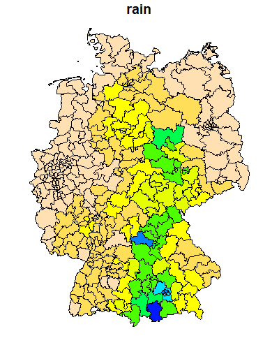

```{r setup, include=FALSE}
knitr::opts_chunk$set(echo = TRUE)

# loading some functions
source("https://raw.githubusercontent.com/SuShikano/StatTeaching/main/func/ci_sample_mean.R")
source("https://raw.githubusercontent.com/SuShikano/StatTeaching/main/func/robust_se_srm.R")

```

## Preparing data

We download the official results of 2021 German Federal Election. 

```{r, echo = TRUE}

library(foreign)

url.result <- "https://www.bundeswahlleiter.de/dam/jcr/fc2afe29-c086-43eb-bc34-a48356dee154/btw21_kerg.csv"
# reading the results
rawdata <- read.csv(url.result,
                    skip=5,sep=";",header = FALSE,encoding="UTF-8")

# reading the labels
main.labels <- read.csv(url.result,
                        skip=2,nrows=1,sep=";",header = FALSE,
                        colClasses = "character",encoding="UTF-8")

# reading the second line of the labels
first.second.votes <- read.csv(url.result,
                               skip=3,nrows=1,sep=";",header = FALSE)
first.second.votes[1:3] <- "aaa" 

# delete previous results and state-level results
result21 <- rawdata[,!is.na(first.second.votes)]
result21 <- result21[result21[,3]!=99 & !is.na(result21[,3]),]

# keep previous results and delete stat-level results
result17 <- rawdata[,is.na(first.second.votes)|first.second.votes=="aaa"]
result17 <- result17[result17[,3]!=99 & !is.na(result17[,3]),]
result17 <- result17[,1:ncol(result21)]

# make the labels
main.labels <- main.labels[!is.na(first.second.votes)]
main.labels[seq(5,length(main.labels),by=2)] <-    main.labels[seq(4,length(main.labels)-1,by=2)] # adding the label for SMD and PR votes

main.labels <- paste(main.labels,first.second.votes[!is.na(first.second.votes)])
main.labels <- gsub("aaa","",main.labels)

main.labels <- gsub("ä","ae",main.labels)
main.labels <- gsub("Ä","Ae",main.labels)
main.labels <- gsub("ö","oe",main.labels)
main.labels <- gsub("Ö","Oe",main.labels)
main.labels <- gsub("ü","ue",main.labels)
main.labels <- gsub("Ü","Ue",main.labels)

colnames(result21) <- colnames(result17) <- main.labels

```

After data cleaning, the dataset contains 299 electoral districts as unit.

We further download socio-demographic data for the districts.

```{r, echo = TRUE}

url.sociodem <- "https://www.bundeswahlleiter.de/dam/jcr/b1d3fc4f-17eb-455f-a01c-a0bf32135c5d/btw21_strukturdaten.csv"
rawdata <- read.csv(url.sociodem,
                    skip=8,sep=";",dec = ",",
                    header = TRUE,encoding="UTF-8")

# delete the state-level results
sociodem <- rawdata[rawdata[,2]<500,]

```

## Obtaining variables as vectors

- old.gen: percentage of the older generation (age 60+)
- gdp: GDP per capita
- eligible: number of eligible citizens to vote
- valid: number of valid votes
- tunrout: turnout rate (in %)
- union.pr: vote share of CDU/CSU (in %)

```{r, echo = TRUE}

gdp <- sociodem[,grep("Bruttoinlandsprodukt",names(sociodem))]

old.gen <- sociodem[,grep("Alter",names(sociodem))]
old.gen <- old.gen[,5] + old.gen[,6]
young.gen <- sociodem[,grep("Alter",names(sociodem))]
young.gen <- young.gen[,2] 

abi <- sociodem[,grep("allgemeiner.und.Fachhochschulreife",names(sociodem))]

  
  
unemployment <- sociodem[,grep("Arbeitslosenquote",names(sociodem))]
unemp.total <- unemployment[,grep("insgesamt",names(unemployment))]
unemp.young <- unemployment[,grep("15.bis.24.Jahre",names(unemployment))]

pkw <- sociodem[,grep("PKW",names(sociodem))]
pkw.e <- pkw[,grep("Elektro",names(pkw))]
pkw <- pkw[,grep("insgesamt",names(pkw))]

company <- sociodem[,grep("Unternehmen.insgesamt",names(sociodem))]

## from here election results

eligible <- result21[,grep("Wahlberechtigte Zweitstimmen",names(result21))]
eligible.17 <- result17[,grep("Wahlberechtigte Zweitstimmen",names(result17))]
valid <- result21[,grep("Gueltige Stimmen Zweitstimmen",names(result21))]
valid.17 <- result17[,grep("Gueltige Stimmen Zweitstimmen",names(result17))]

turnout <- valid *100/ eligible
turnout.17 <- valid.17 *100/ eligible.17

cdu.pr <- result21[,grep("Christlich Demokratische Union Deutschlands Zweitstimmen",names(result21))]

csu.pr <- result21[,grep("Christlich-Soziale Union in Bayern e.V. Zweitstimmen",names(result21))]

union.pr <- cdu.pr
union.pr[is.na(union.pr)] <- csu.pr[is.na(union.pr)]

union.pr <- union.pr*100/valid

spd.pr <- result21[,grep("Sozialdemokratische Partei Deutschlands Zweitstimmen",names(result21))]
spd.pr <- spd.pr *100/valid


gru.pr <- result21[,grep("BUeNDNIS 90/DIE GRUeNEN Zweitstimmen",names(result21))]
gru.pr <- gru.pr *100/valid

fdp.pr <- result21[,grep("Freie Demokratische Partei Zweitstimmen",names(result21))]
fdp.pr <- fdp.pr *100/valid

afd.pr <- result21[,grep("Alternative fuer Deutschland Zweitstimmen",names(result21))]
afd.pr <- afd.pr *100/valid

afd.pr.17 <- result21[,grep("Alternative fuer Deutschland Zweitstimmen",names(result17))]
afd.pr.17 <- afd.pr.17 *100/valid.17


gru.smd <- result21[,grep("BUeNDNIS 90/DIE GRUeNEN Erststimmen",names(result21))]
gru.smd <- gru.smd *100/valid

gru.smd.17 <- result17[,grep("BUeNDNIS 90/DIE GRUeNEN Erststimmen",names(result17))]
gru.smd.17 <- gru.smd.17 *100/valid.17

```

## Joint distributions

We observe two joint distributions:

```{r, echo = TRUE}

par(mfrow=c(1,2))
plot(gdp,turnout,xlab="GDP per capita",ylab="Turnout (%)")
plot(old.gen,union.pr,xlab="Age 60+ (%)",ylab="CDU/CSU (%)")

```


## Variances and covariances

```{r, echo = TRUE}
cov(cbind(gdp,old.gen,turnout,union.pr))
```

The diagonal elements are variances. The off-diagonal elements are covariances. Here, you have to be able to calculate the slope of the regression lines. Calculate the regression slopes (Turnout on GDP and CDU/CSU on older generation).

## Calculating the regression slopes

To obtain the regression slope, we can divide covariance of the dependent and independent variable by the variance of independent variable. We now estimate the slop for the following regression model:

- turnout = $\beta_0$ + $\beta_1$ gdp + u
```{r, echo = TRUE}
cov(turnout,gdp)/var(gdp)
```

- union.pr = $\beta_0$ + $\beta_1$ old.gen + u
```{r, echo = TRUE}
cov(union.pr,old.gen)/var(old.gen)
```

## Simple regression models (Turnout on GDP)

```{r, echo = TRUE}
lm.out.1 <- lm(turnout ~ gdp)
summary(lm.out.1)
```
You can check whether your hand-calculated regression slope corresponds to the output.


## Simple regression models (Vote for CDU/CSU on age 60+)

```{r, echo = TRUE}
lm.out.2 <- lm(union.pr ~ old.gen)
summary(lm.out.2)
```

## Simple regression models (graphical presentation)

```{r, echo = TRUE}
par(mfrow=c(1,2))
plot(gdp,turnout,xlab="GDP per capita",ylab="Turnout (%)")
abline(lm.out.1)
plot(old.gen,union.pr,xlab="Age 60+ (%)",ylab="CDU/CSU (%)")
abline(lm.out.2)
```


## Regression parameters as random parameters

Now, we change the perspective and treat our data as population, from which we draw random samples. More concretely, we randomly sample 100 districts from 299 all districts and draw the regression line. This is repeated for 1000 times.

```{r, echo = TRUE}
n.iter <- 1000
sample.size <- 100

estimates <- matrix(NA,ncol=2,nrow=n.iter)
plot(old.gen,union.pr,xlab="Age 60+ (%)",ylab="CDU/CSU (%)")
for (i in 1:n.iter){
  this.sample <- sample(1:length(union.pr),size = sample.size)
  this.lm.out <- lm(union.pr[this.sample] ~ old.gen[this.sample])
  estimates[i,] <- coefficients(this.lm.out)
  abline(this.lm.out,col="grey")
}
```

We can observe the distribution of slopes based on 1000 samples.

```{r, echo = TRUE}
hist(estimates[,2],xlab="Slope",main="")
```

The mean of this distribution is `r round(mean(estimates[,2]),4)`.

This estimator (estimand: the regression line based on all 299 districts) is likely to be biased due to the violation of the zero conditional mean assumption.


To see this, we can check the joint distribution of the errors and the independent variable (Age 60+).

```{r, echo = TRUE}
par(mfrow=c(1,2))
plot(old.gen,union.pr,xlab="Age 60+ (%)",ylab="CDU/CSU (%)")
abline(lm.out.2)

errors <- lm.out.2$residuals

plot(old.gen,errors,xlab="Age 60+ (%)",ylab="Errors")
abline(h=0)


```

If we calculate the mean errors for different x values, it is clearly to see that the estimated regression line tends to over-predict the CDU/CSU share for the districts with about 25% and those with 35% or more.  

```{r}
y.range <- range(errors)
x.range <- range(old.gen)

plot(errors ~ old.gen,ylab="Errors",xlab="Age 60+",
     xlim=x.range,ylim=y.range)

x.values <- seq(min(old.gen),max(old.gen),length=25)
x.interval <- x.values[2] -x.values[1]

conditional.mean <- lower.b <- upper.b <- rep(NA,length(x.values))
for (i in 1:length(conditional.mean)){
  
  selected.error <- errors[(old.gen>(x.values[i]-x.interval)) & 
                                             (old.gen<(x.values[i]+x.interval)) ]
  conditional.mean[i] <- mean(selected.error)
  this.ci <- ci.sample.mean(selected.error)
  lower.b[i] <- this.ci$lower.b
  upper.b[i] <- this.ci$upper.b
  
}

par(new=T)
plot(conditional.mean ~ x.values,ann=F,axes=F,
     xlim=x.range,ylim=y.range,
     col="red",pch=19,type="b")
abline(h=0,lty=2,lwd=3)
for (i in 1:length(conditional.mean)){
  lines(rep(x.values[i],2),c(upper.b[i],lower.b[i]),col="red",lwd=2)
}


```


Furthermore, the homoscedasticity assumption seems to be violated, as well. The red points in the below figure show the standard deviations of the errors for different x values with their 95%-confidence intervals (vertical red lines). Accordingly, the error variance is larger for smaller x values.


```{r}
y.range <- range(errors)
x.range <- range(old.gen)

plot(errors ~ old.gen,ylab="Errors",xlab="Age 60+",
     xlim=x.range,ylim=y.range)

x.values <- seq(min(old.gen),max(old.gen),length=25)
x.interval <- x.values[2] -x.values[1]

conditional.sd <- lower.b <- upper.b <- rep(NA,length(x.values))
for (i in 1:length(conditional.sd)){
  
  selected.error <- errors[(old.gen>(x.values[i]-x.interval)) & 
                                             (old.gen<(x.values[i]+x.interval)) ]
  conditional.sd[i] <- sd(selected.error)
  
  dof <- length(selected.error)-1
  
  lower.b[i] <- sqrt(conditional.sd[i]^2*dof/qchisq(0.975,df=dof))
  upper.b[i] <- sqrt(conditional.sd[i]^2*dof/qchisq(0.025,df=dof))
  
}

par(new=T)
plot(conditional.sd ~ x.values,ann=F,axes=F,
     xlim=x.range,ylim=y.range,
     col="red",pch=19,type="b")
abline(h=0,lty=2,lwd=3)
for (i in 1:length(conditional.sd)){
  lines(rep(x.values[i],2),c(upper.b[i],lower.b[i]),col="red",lwd=2)
}


```

## Variance decomposition and Goodness of Fit

To discuss the variance decomposition and goodness of fit, we come back to the first regression model:

```{r}
summary(lm.out.1)

plot(gdp,turnout,xlab="GDP per capita",ylab="Turnout (%)")
abline(lm.out.1)

```

Based on the regression result above, we can calculate the following three sum of squares

```{r}

SST <- mean((turnout - mean(turnout))^2)
SST

SSE <- mean((lm.out.1$fitted.values - mean(turnout))^2)
SSE

SSR <- mean((lm.out.1$residuals )^2)
SSR

r.squared <- SSE/SST
r.squared
```

Obviously, the total sum of squares of y can be decomposed to SSE and SSR. And the share of SSE in SST is the r-squared, which is a goodness of fit measure of the model.

## Estimating variances of errors and OLS estimates

```{r, echo = TRUE}
SSR <- sum(lm.out.1$residuals^2) # residual square sum
sigma2.hat <- SSR/lm.out.1$df.residual # estimated variance of errors

lm.out.1$df.residual
sqrt(sigma2.hat)

SST.x <- sum((gdp-mean(gdp))^2) # total square sum of X (GDP)

sigma2.beta1 <- sigma2.hat/SST.x 
sqrt(sigma2.beta1) # standard error of beta_1
```

Check this result with the output above. 


## Multiple regression analysis


```{r}
pairs(cbind(afd.pr,gdp,unemp.total,unemp.young),
      labels=c("AfD (%)","GDP per capita","Unemployment (%)","Unemp.young (%)"),
      lower.panel = NULL)

```


```{r, echo = TRUE}
srm.out <- lm(afd.pr ~ gdp)
summary(srm.out)

plot(gdp,afd.pr,xlab="GDP per capita",ylab="AfD (%)")
abline(srm.out)
```

The slope estimate has a very small effect size (`r round(coef(srm.out)[2],6)`), which is due to the large number of the independent variable (GDP per capita). That is, one Euro increase in GDP leads to only a small change in the AfD vote share. 

We can now change the scale of the independent variable to thousand Euro and estimate the same model.

```{r}
gdp.tsd <- gdp/1000

srm.out <- lm(afd.pr ~ gdp.tsd)
summary(srm.out)

plot(gdp.tsd,afd.pr,xlab="GDP per capita (TSD)",ylab="AfD (%)")
abline(srm.out)

```

Now the slope estimate is much larger since it is about the change of AfD vote share for 1000 Euro increase in GDP.


If we add another variable (unemployment of younger citizens), the point estimate of the GDP becomes closer to zero.

```{r, echo = TRUE}
mrm.out <- lm(afd.pr ~ gdp.tsd + unemp.young)
summary(mrm.out)
```

To see why this differences in the estimates between two models, we can regress gdp on unemployment.

```{r, echo = TRUE}
gdp.unemp <- lm(gdp.tsd ~ unemp.young)
summary(gdp.unemp)
```
GDP is negatively correlated with the youth unemployment rate. We can now regress the share of AfD on the residual (part of GDP which cannot be predicted by the youth unemployment rate.)

```{r, echo = TRUE}
residuals <- gdp.unemp$residuals
afd.resid <- lm(afd.pr ~ residuals)
summary(afd.resid)
```

Compare with the result of the multiple regression model. The point estimate is identical with that of GDP.


## The omitted variable bias

```{r, echo = TRUE}
simple <- lm(afd.pr ~ gdp.tsd)
summary(simple)
multiple <- lm(afd.pr ~ gdp.tsd + unemp.young)
summary(multiple)
```

If the model with two independent variables is true, the first one is misspecified. The bias can be calculated as follows:

```{r, echo = TRUE}
# extracting the relevant estimates
beta.1.s <- simple$coefficients[2]
beta.1.m <- multiple$coefficients[2]
beta.2.m <- multiple$coefficients[3]

# regress the omitted variable on the other variable
unemp.gdp <- lm(unemp.young ~ gdp)

# extracting the coefficient
delta.1 <- unemp.gdp$coefficients[2]

# biased estimate in SRM
beta.1.s
# true estimate in MRM
beta.1.m
# reconstructing the biased estimate by using the MRM estimates
beta.1.m + beta.2.m*delta.1
# bias
beta.2.m*delta.1

```

The bias constitutes the effect of the omitted variable and its relationship with the other variable.

## Homoskedasticity

The one of the Gauss-Markov-assumptions is about the variance of errors. While we cannot directly observe the errors, we can obtain certain information about the errors by observing residuals and comparing them with independent variables/fitted values.

```{r, echo = TRUE}
# extracting the relevant estimates
lm.out <- lm(afd.pr ~ gdp + unemp.young)
summary(lm.out)

par(mfrow=c(1,3))
plot(gdp,lm.out$residuals,
     xlab="Predicted value",
     ylab="GDP per capita")
abline(h=0,lty=2)
plot(unemp.young,lm.out$residuals,
     xlab="Predicted value",
     ylab="Unemployment")
abline(h=0,lty=2)
plot(lm.out$fitted.values,lm.out$residuals,
     xlab="Predicted value",
     ylab="Residuals")
abline(h=0,lty=2)


```

The distributions indicate violence of the homoskedasticity assumption, thus the biased estimates of the regression coefficients' variances.

## Model selection

You regress the vote share of FDP on the following variables:

* Number of companies per 1000 inhabitants
* Number of registered cars per 1000 inhabitants
* Number of registered electronic/hybrid cars per 1000 inhabitants
* Share of the older generation
* Share of the younger generation


```{r}
summary(lm.out <- lm(fdp.pr ~ company + pkw + pkw.e  + young.gen +  old.gen))


```

Since the last two variables concerning the generation are not significant, you estimated another model without these variables:


```{r}
summary(lm.out.res <- lm(fdp.pr ~ company + pkw + pkw.e  ))


```

Now you wish to decide for one of the two models. In such a situation, the typical approach is to compute the F-values based on both outcomes:


```{r}
    SSR.ur <- sum(lm.out$residuals^2)
    SSR.r <-  sum(lm.out.res$residuals^2)
    q <- lm.out.res$df.residual - lm.out$df.residual

    F <-  ((SSR.r - SSR.ur)/q)/(SSR.ur/lm.out$df.residual)

    F
```

The computed F-value is then compared with the corresponding F-distribution:

```{r}

x.scale <- seq(0,10,by=0.01)
this.y <- df(x.scale,df1=q,df2=lm.out$df.residual)

plot(x.scale,this.y,type="l",xlab="t",ylab="Density",
       main=paste("F-distribution with df=",q,"and",lm.out$df.residual))

this.95 <- qf(c(.95),df1=q,df2=lm.out$df.residual)
abline(v=this.95,lty=2)
text(1,0.2,"95%")
text(this.95,0,pos=2,round(this.95,3))
text(this.95,0.2,"Rejection region",pos=4)

emp.sig <- 1-pf(F,df1=q,df2=lm.out$df.residual)

abline(v=F,col="red")
text(F,0.1,
     paste0("F=",round(F,3),"; p=",round(emp.sig,5)),
     pos=4)
```

Accordingly, we can reject the null-hypothesis that both models are equivalent and decide for the first unrestricted model.


An alternative approach is based on the Lagrange Multiplier statistic:


```{r}

r.tilde <- residuals(lm.out.res)

summary(lm.out.lagr <- lm(r.tilde ~ company + pkw + pkw.e  + young.gen +  old.gen))

r.square.u <- summary(lm.out.lagr)$r.squared

LM <- r.square.u * nrow(lm.out.lagr$model)

LM

```

The calculated LM-value is compared with the corresponding chi-square distribution:

```{r}

x.scale <- seq(0,20,by=0.01)
this.y <- dchisq(x.scale,df=q)

plot(x.scale,this.y,type="l",xlab="t",ylab="Density",
       main=paste("Chi^2-distribution with df=",q))

this.95 <- qchisq(c(.95),df=q)
abline(v=this.95,lty=2)
text(1,0.2,"95%")
text(this.95,0,pos=2,round(this.95,3))
text(this.95,0.2,"Rejection region",pos=4)

emp.sig <- 1-pchisq(LM,df=q)

abline(v=LM,col="red")
text(LM,0.05,
     paste0("LM=",round(LM,3),"; p=",round(emp.sig,5)),
     pos=4)

```

Accordingly, you can obtain the same result of the above F-test.

## Using logarithm 

Recall the following regression model:

```{r}
gdp.tsd <- gdp/1000

srm.out <- lm(afd.pr ~ gdp.tsd)
summary(srm.out)

plot(gdp.tsd,afd.pr,xlab="GDP per capita (TSD)",ylab="AfD (%)")
abline(srm.out)

```

The joint distribution of both variables shows certain outlier districts whose GDP is very high.

In such cases, one can consider to transform the variable by using the logartihmic function.

```{r}

gdp.tsd.log <- log(gdp.tsd)

par(mfrow=c(1,2))

hist(gdp.tsd,
     main="GDP (in TSD Euro)",xlab="",
     freq=FALSE)

hist(gdp.tsd.log,
     main="GDP (logarithmized",xlab="",
     freq=FALSE)

```

```{r}
srm.out.2 <- lm(afd.pr ~ gdp.tsd.log)
summary(srm.out.2)

plot(gdp.tsd.log,afd.pr,xlab="GDP per capita (TSD, log)",ylab="AfD (%)")
abline(srm.out.2)

```

To interpret the slope coefficient of a logarithmized variable is tricky. According to the regression result above, unit increase of log GDP is associated with increase of `r coef(srm.out.2)[2]`. However, a unit increase of the log GDP is not constant on the scale of the raw GDP.

To see what a unit increase of the log GDP means, we can first check the logarithm function.

```{r}
curve(log,0,70,axes=F)
axis(1,at=exp(seq(0,5)),
     c("",round(exp(seq(1,5)),2))
     )
axis(2,at=seq(0,5))

for (i in 1:4){
  lines(c(0,exp(i)),rep(i,2),lty=2)
  lines(rep(exp(i),2),c(0,i),lty=2)
}

```

Note that the opposite function of log() is the exponential function (exp()). To solve e.g. log(x)=2 for x, we can calculate just exp(2)=`r exp(2)`.

The above figure clearly demonstrates that increase from log(2) to log(3) and that from log(3) to log(4) correspond different increase in the raw scale. If you however take the growth, it is constant. That is:

- exp(3)/exp(2) = `r round(exp(3),2)`/`r round(exp(2),2)` = `r exp(3)/exp(2)`
- exp(4)/exp(3) = `r round(exp(4),2)`/`r round(exp(3),2)` = `r exp(4)/exp(3)`

That is, we can interpret the coefficient of the log GDP (`r coef(srm.out.2)[2]`) as change in Y given X grows constantly. More specifically, given a district's GDP is 1% higher, the the AfD share will change with `r coef(srm.out.2)[2]`/100.


Consequently, the result will not change if we take the log of GDP in Euro instead of in thousand Euro:

```{r}
gdp.log <- log(gdp)

head(cbind(gdp,gdp.log,gdp.tsd,gdp.tsd.log),n=10)


summary(srm.out.3 <- 
          lm(afd.pr ~ gdp.log))

```

Thus far, we logarithmized the independent variable, but the distribution of the dependent variable also has some outliers.

```{r}
afd.pr.log <- log(afd.pr)

par(mfrow=c(1,2))

hist(afd.pr,
     main="AfD vote share",xlab="",
     freq=FALSE)

hist(afd.pr.log,
     main="AfD vote share (logarithmized)",xlab="",
     freq=FALSE)
```


```{r}

srm.out.4 <- lm(afd.pr.log ~ gdp.tsd.log)
summary(srm.out.4)


```

Having learned about the properties of logarithmized variables, the interpretation of this result is now straighforward. The estimated slope give information about what growth for AfD vote share in a district we expect for one-percent growth of the district's GDP.


In this model, the percentage change of AfD vote share for the percent change of GDP is constant: $\frac{\% \Delta y}{\% \Delta x} = \beta_1$. This is called elasticity (see Appendix A) and the model above is called the constant elasticity model.

Elasticity of y in respect to x: $\frac{\% \Delta y}{\% \Delta x}$.


Besides reducing the effect of outliers on the estimated results, using logarithmized variables has another important advantage. To see this, we compare the joint distributions based on the raw variables and logarithmized variables:


```{r}
par(mfrow=c(1,2))

plot(gdp.tsd,afd.pr,xlab="GDP per capita (TSD)",ylab="AfD (%)")
abline(srm.out)

plot(gdp.tsd.log,afd.pr.log,xlab="GDP per capita (TSD, log)",ylab="AfD (%, log)")
abline(srm.out.4)

```


In the left-hand panel, the joint distribution seems to violate a series of the GM-assumptions such like linearity, zero conditional mean and heteroskedasticity. In the right-hand panel with the logarithmized variables, the joint distribution seems to be more conform with the GM-assumptions. 


```{r}
par(mfrow=c(1,2))

hist(srm.out$residuals,xlab="Residuals",main="Both in the raw scale",
     freq=F)

hist(srm.out.4$residuals,xlab="Residuals",main="Both logarithmized",
     freq=F)

```

The distributions of the residuals also shows that the model with the logarithmized dependent and independent variables much better resembles the normal distribution, even though it is not perfect.


Above, we have already seen that the logarithm function and the exponential function are the opposite function to each other. 


Therefore, $\ln(y) = \beta_0 + \beta_1 x + u$ is equivalent to $y = \exp(\beta_0 + \beta_1 x + u)$. Consider the following model:

```{r, echo = TRUE}
srm.out.5 <- lm(afd.pr.log ~ gdp.tsd)
summary(srm.out.5)
```


This result can be visualized as follows:

```{r}
x.values <- seq(min(gdp.tsd),max(gdp.tsd),length=100)
predicted <- exp(coefficients(srm.out.5)[1] + coefficients(srm.out.5)[2]*x.values)

par(mfrow=c(1,2))
plot(gdp.tsd,log(afd.pr),
     xlim=range(gdp.tsd),ylim=range(log(afd.pr)),
     xlab="GDP per capita (TSD)",ylab="Log of AfD (%)")
abline(srm.out.5)

plot(gdp.tsd,afd.pr,
     xlim=range(gdp.tsd),ylim=range(afd.pr),
     xlab="GDP per capita (TSD)",ylab="AfD (%)")
par(new=T)
plot(x.values,predicted,type="l",
     xlim=range(gdp.tsd),ylim=range(afd.pr),
     axes=F,ann=F,xlab="",ylab="")
```

The right hand side panel is based on the raw scales. Correspondingly, the predicted value was transformed by the exponential function. This predicted values, however, are systematically underestimated and biased. This is because the estimated residuals do not have unit mean ($exp(0)=1$) after exponentiation:


```{r}
par(mfrow=c(1,2))
hist((srm.out.5$residuals),main=paste("Mean:", round(mean(srm.out.5$residuals),3)),xlab="residuals")
hist(exp(srm.out.5$residuals),main=paste("Mean:", round(mean(exp(srm.out.5$residuals)),3)),xlab="exp(residuals)")
```

Under the CLM-assumptions, therefore, we have to correct that bias by using the average exponentiated residuals:


```{r}
alpha.0.hat <- mean(exp(srm.out.5$residuals))

correct.predicted <- alpha.0.hat*predicted


par(mfrow=c(1,2))
plot(gdp.tsd,log(afd.pr),
     xlim=range(gdp.tsd),ylim=range(log(afd.pr)),
     xlab="GDP per capita (TSD)",ylab="Log of AfD (%)")
abline(srm.out.5)

plot(gdp.tsd,afd.pr,
     xlim=range(gdp.tsd),ylim=range(afd.pr),
     xlab="GDP per capita (TSD)",ylab="AfD (%)")
par(new=T)
plot(x.values,predicted,type="l",
     xlim=range(gdp.tsd),ylim=range(afd.pr),
     axes=F,ann=F,xlab="",ylab="")
par(new=T)
plot(x.values,correct.predicted,type="l",
     xlim=range(gdp.tsd),ylim=range(afd.pr),col="red",
     axes=F,ann=F,xlab="",ylab="")

```

The red line in the right-hand panel is corrected prediction ($\hat\alpha_0 \exp(\beta_0 + \beta_1 x)$). They would never be negative. 


## Models with Quadratics/Interaction Terms


Suppose we are interested in the relationship between AfD vote share and the youth unemployment rate. 


First, we can observe the joint distribution.

```{r}
plot(unemp.young,afd.pr)
```

Subsequently, we can regress the AfD share on the unemployment rate:

```{r}
srm.out <- lm(afd.pr ~ unemp.young)
summary(srm.out)

```

There seems to be a positive effect of the unemployment rate on the SPD vote share.


```{r}
plot(unemp.young,afd.pr,xlab="Unemployment (%)",ylab="AfD percentage")
abline(srm.out)
```

At the same time, there seems to be a curve-linear relationship. To test this, we add the quadratic term to the regression:

```{r}
unemployment.qrd <- unemp.young^2

quadratics.out <- lm(afd.pr ~ unemp.young + unemployment.qrd)
summary(quadratics.out)

```

The result shows a curve linear relationship.

```{r}
# make predition
xvalues <- seq(min(unemp.young),max(unemp.young),length=100)
predicted <- coefficients(quadratics.out)[1] + 
             coefficients(quadratics.out)[2]*xvalues + 
             coefficients(quadratics.out)[3]*(xvalues^2)  

# plot
plot(unemp.young,afd.pr,xlab="Unemployment (%)",ylab="AfD percentage",ylim=range(afd.pr))
abline(srm.out)
par(new=T)
plot(xvalues,predicted,type="l",axes=F,ann=F,xlab="",ylab="",
     ylim=range(afd.pr),col="blue")

```

However, the quadratic term is not significant and if one compare both models by using F-statistic, the curve linear model is not superior to the simple linear model.

Still, in the mid of x-value range, the data tend to have positive residuals than the other ranges. Now, we take another approach with an interaction term. That is, we assume the effect of unemployment can vary depending on another independent variable "West or East Germany".


```{r}
bundesland <- sociodem[,"Land"]
east.index <- c(grep("Mecklenburg",bundesland),
                grep("Brandenburg",bundesland),
                grep("Sachsen",bundesland),
                grep("ringen",bundesland))

east.dummy <- rep(0,length(bundesland))
east.dummy[east.index] <- 1

interaction.out <- lm(afd.pr ~ unemp.young*east.dummy)
summary(interaction.out)

```

The result is better interpreted by visualizing it:

```{r}
reg.coef.west <- coefficients(interaction.out)[c(1,2)]
reg.coef.east <- coefficients(interaction.out)[c(1,2)] + coefficients(interaction.out)[c(3,4)]

# plot
plot(unemp.young[east.dummy==0],afd.pr[east.dummy==0],
     xlab="Unemployment (%)",ylab="AfD percentage",
     col="green",pch=19,
     xlim=range(unemp.young),ylim=range(afd.pr))
par(new=T)
plot(unemp.young[east.dummy==1],afd.pr[east.dummy==1],
     col="red",pch=19,
     ann=F,axes=F,xlab="",ylab="",
     xlim=range(unemp.young),ylim=range(afd.pr))
abline(srm.out)
par(new=T)
#plot(xvalues,predicted,type="l",axes=F,ann=F,xlab="",ylab="",
#     ylim=range(afd.pr),col="blue")
abline(reg=reg.coef.west,col="green",lty=1)
abline(reg=reg.coef.east,col="red",lty=1)
legend("topright",lty=1,col=c("green","red"),
       c("West","East"),
       bty="n"
)
```

Suprizingly, the positive effect of youth unemployment above was due to the heterogeneity of West and East German districts. According to the current model with the interaction, yourh unemployment has no significant result in West and even a significant negative effect in East.


The effect of unemployment can depend on further factors, e.g. the GDP level:

```{r}
interaction.2.out <- lm(afd.pr ~ unemp.young * gdp.tsd)
summary(interaction.2.out)

```

The partial effect of the unemployment rate on the AfD vote share is $2.85499 -0.06203 \times gdp.tsd$. By considering the range of the GDP (in Tsd), we can obtain the range of the partial effect:

```{r}
range.gdp.tsd <- range(gdp.tsd)
range.gdp.tsd

range.partial.effect <- coefficients(interaction.2.out)[2] +                  
                        coefficients(interaction.2.out)[4]*range.gdp.tsd  
range.partial.effect
```

For better interpretation, we can reparametrize the model:

```{r}
unemployment.center <- unemp.young-mean(unemp.young)
gdp.tsd.center <- gdp.tsd - mean(gdp.tsd)

interaction.3.out <- lm(spd.pr ~ unemp.young + gdp.tsd + 
                          unemployment.center:gdp.tsd.center)
summary(interaction.3.out)

```

The main effect of the unemployment rate corresponds to the partial effect of the unemployment rate if the GDP in Tsd is its average value:

```{r}
coefficients(interaction.2.out)[2] +                  
                        coefficients(interaction.2.out)[4]*mean(gdp.tsd)
```


## Heteroskedasticity

Let's turn to the very first model which we estimated:

```{r, echo = TRUE}


plot(gdp.tsd,turnout,xlab="GDP per capita (in TSD Euro)",ylab="Turnout (%)")


```


Simple regression models (Turnout on GDP)

```{r, echo = TRUE}
lm.out.1 <- lm(turnout ~ gdp.tsd)
summary(lm.out.1)
```

Graphical presentation

```{r, echo = TRUE}

plot(gdp.tsd,turnout,xlab="GDP per capita",ylab="Turnout (%)")
abline(lm.out.1)
```

### Heteroskedasticity-Robust Inference after OLS Estimation

We first calculate the variance of the slope under the homoskedasticity assumption according to Eqn 8.2 but with $\sigma^2$ instead of $\sigma^2_i$.

For the first model (Turnout ~ GDP), we first obtain the variance of the slope and its square rood (the standard error):


```{r}
var.slope.1 <- sum((gdp.tsd - mean(gdp.tsd))^2*(summary(lm.out.1)$sigma^2))/((sum((gdp.tsd - mean(gdp.tsd))^2))^2)

var.slope.1
sqrt(var.slope.1)
```

The calculated standard error corresponds to that in the output before.

Now, we consider the different residual size of the individual observations. That is, we consider $\hat{u}_i^2$ as in Equation 8.3:

```{r}
var.slope.1.het <- sum((gdp.tsd - mean(gdp.tsd))^2*(lm.out.1$residuals^2))/((sum((gdp.tsd - mean(gdp.tsd))^2))^2)

var.slope.1.het
sqrt(var.slope.1.het)
```

This **heteroskedasticity-robust** standard error is larger than the previous naive one. If one checks the previous graphic of the joint distribution with the regression line, we can observe a larger variance of residuals in the districts with lower GDP than in those with higher GDP. This heteroskedasticity lead to the higher robust standard error.


### Testing for Heteroskedasticity

Our null-hypothesis is that the homoskedasticity is true: $H_0: Var(u|x_1,...,x_k)=\sigma^2$, which is equvalent to:

$H_0: E(u^2|x_1,...,x_k)=\sigma^2$.

This can be tested by regressing the squared residuals on the same independent variables of the regression model of interest:

```{r}
resid.sq <- (lm.out.1$residuals)^2

resid.lm.out <- lm(resid.sq ~ gdp.tsd )
summary(resid.lm.out)
```

In the output, we can just check the overall significance of regression. In this case, F=`r round(summary(resid.lm.out)$fstatistic[1],3)` is not in the rejection region (for p=0.05). Therefore, we cannot reject the null-hypothesis.


Above, we tested the original homoskedastiticy assumption that $E(u|x)=0$. We can instead the weaker version of the assumption $Cov(x,u)=0$ (see Chapter 5). To do this, we can apply the White test, which regresses the squared residuals on the predicted values and the squared predicted values:

```{r}
predict <- lm.out.1$fitted.values
predict.sq <- lm.out.1$fitted.values^2

white.lm.out <- lm(resid.sq ~ predict + predict.sq)
summary(white.lm.out)
```

Also here, we cannot reject the null hypothesis.

Below we repeat the same exercise for a multiple regression : turnout ~ gdp + young unemployment:


```{r}
lm.out.3 <- lm(turnout ~ gdp.tsd + unemp.young )
summary(lm.out.3)
```

First, we regress the suqared residuals on all independent variables:

```{r}
resid.sq <- (lm.out.3$residuals)^2

resid.lm.out <- lm(resid.sq ~ gdp.tsd + unemp.young)
summary(resid.lm.out)
```

In this case, we reject the null hypothesis for 5% significance level.

The White test gives the following result:

```{r}
predict <- lm.out.3$fitted.values
predict.sq <- lm.out.3$fitted.values^2

white.lm.out <- lm(resid.sq ~ predict + predict.sq)
summary(white.lm.out)
```

Here, we can also reject the null-hypothesis. Note that we are testing two slightly different null-hypothesis. The first test with the original homoskedasticity assumption and the other the weaker version of that.


### Weighted Least Squares Estimation

In the above, analysis, we saw the squared residuals are positively correlated with the share of youth unemployment (the variable $unemp.young$). Now we assume that the residual variance is proportional to this variable: $Var(u_i|unemp.young_i)=\sigma^2 unemp.young_i$. 

Under this assumption, we divide all the variables by the square root of the "unemp.young" variable and estimate the coefficients:

```{r}
turnout.star <- turnout/sqrt(unemp.young)
interc.star <- 1/sqrt(unemp.young)
gdp.star <- gdp.tsd/sqrt(unemp.young)
unemp.young.star <- unemp.young/sqrt(unemp.young)


wls.out <- lm(turnout.star ~ 0 + interc.star + gdp.star + unemp.young.star )
summary(wls.out)

```

This is the result of the Weighted Least Squares (WLS) estimation. To compare, we will check the OLS results again.

```{r}
summary(lm.out.3)
```

## 8.4 Feasible Generalized Least Squares esimation


WLS required a certain heteroskedasticity function ($Var(u_i|unemp.young_i)=\sigma^2 unemp.young_i$ in the above example).

In many cases, the exact form of the heteroskedasticity is not known. In such case, we can estimate the heteroskedasticity function.

We assume the following function:

$Var(u|x) = \sigma^2 \exp(\delta_0 + \delta_1 x_1 + ... + \delta_k x_k)$

with $\delta_0 ... \delta_k$ being unknown parameters.

The above equation can be reformulated as follows:

$Var(u|x) = E(u^2|x) = \sigma^2 \exp(\delta_0 + \delta_1 x_1 + ... + \delta_k x_k)$

By assuming $\nu$ a random variable with unit mean:

$u^2 = \sigma^2 \exp(\delta_0 + \delta_1 x_1 + ... + \delta_k x_k)\nu$.

Taking the log of both sides of the equation:

$\ln(u^2) = \ln(\sigma^2) + \delta_0 + \delta_1 x_1 + ... + \delta_k x_k + e$.

The parameter of this model can be obtained by regressing the log of the squared residuals on the independent variables:

```{r}
resid.sq.log <- log((lm.out.3$residuals^2))

heterosk.func <- lm(resid.sq.log ~ gdp.tsd + unemp.young)
summary(heterosk.func)

```

Here, the estimated parameters are not important, but the predicted values since we are interested in the weights of individual observations. They can be obtained by exponentiating the predicted values:

```{r}
weights <- exp(heterosk.func$fitted.values)
```

Now we can conduct WLS by using the obtained weights:

```{r}
turnout.star <- turnout/sqrt(weights)
interc.star <- 1/sqrt(weights)
gdp.star <- gdp.tsd/sqrt(weights)
unemp.young.star <- unemp.young/sqrt(weights)


fgls.out <- lm(turnout.star ~ 0 + interc.star + gdp.star + unemp.young.star )
summary(fgls.out)
```

To check, we can compare the results with those based on WLS and OLS.

```{r}
summary(lm.out.3)
summary(wls.out)
```

Another possible comparison can be done based on the weights. 

```{r}

par(mfrow=c(1,2))
plot(weights ~ gdp.tsd)

plot(weights ~ unemp.young)
```

The weights used in FGLS is strongly correlated with the GDP variable, which was not used for the WLS estimation. 

## 8.5 The Linear Probability Model Revisited

The linear probability model must contain heteroskedasticity (except $\beta_j=0$ for all j):

$Var(y|x)=p(x)[1-p(x)]$ with $p(x)=\beta_0 + \beta_1 x_1 +...+\beta_k x_k$.

```{r}
var.function <- function(p) p*(1-p)
curve(var.function,0,1,xlab="p(x)",ylab="Var(y)")

```


Two possible remedies: 

- OLS-estimates + robust standard errors.
- WLS-estimates with the weights $\hat{h} = \hat{y}(1-\hat{y})$.

For example, we regress whether AfD exceeded 10% valid votes on GDP:

```{r}
afd.10 <- ifelse(afd.pr>10,1,0)

lpm.out <- lm(afd.10 ~ gdp.tsd)
summary(lpm.out)

plot(afd.10 ~ gdp.tsd,xlab="GDP (TSD)",ylab="AfD exceeds 10%")
abline(lpm.out)

```

The (heteroskedasticits-) robust standard error is:

```{r}
var.slope.lpm.het <- sum((gdp.tsd - mean(gdp.tsd))^2*(lpm.out$residuals^2))/((sum((gdp.tsd - mean(gdp.tsd))^2))^2)

var.slope.lpm.het
sqrt(var.slope.lpm.het)
```

The WLS estimates are:

```{r, error=TRUE}
predicted <- lpm.out$fitted.values
h.hat <- predicted * (1-predicted)

wls.lpm.out <- lm(afd.10 ~ gdp.tsd,weights = 1/h.hat)
summary(wls.lpm.out)
```


This does not work since some predicted values are not in the range $(0,1)$. 


```{r}
predicted <- lpm.out$fitted.values
hist(predicted)
```


The figure shows that some predictions are under zero. This makes $\hat{h}$ negative values, which cannot be used as weight.


One possibility is to adjust those predicted values. We can replace the predicted values below zero with 0.01:


```{r}
predicted <- lpm.out$fitted.values
predicted[predicted<=0] <- 0.01

h.hat <- predicted * (1-predicted)

wls.lpm.out <- lm(afd.10 ~ gdp.tsd,
                  weights = 1/h.hat)
summary(wls.lpm.out)
```

The replaced value 0.01 was arbitrarily chosen. We can also use 0.001:


```{r}
predicted <- lpm.out$fitted.values
predicted[predicted<=0] <- 0.001

h.hat <- predicted * (1-predicted)

wls.lpm.out <- lm(afd.10 ~ gdp.tsd,
                  weights = 1/h.hat)
summary(wls.lpm.out)
```

Here, the result is different since we have a significant amount of predicted values outside of $(0,1)$. In such cases, we should better use the heteroskedasticity-robust statistics.


```{r}
summary(lpm.out)

robust.se.srm(lpm.out)

```


## Pooled-cross sectional data

At the Bundestag election 2021, the Greens were not allowed to run for PR (Zweitstimme) in Saarland due to a formal defect, while they could run candidates for SMDs (Erststimme). We are now interested whether this incident had a negative effect on the Greens' results in SMDs in Saarland. 

If we regress the Greens' results in SMDs on the dummy variable for Saarland, we obtain a significant negative effect.


```{r}

saar.dummy.21 <- ifelse(result21$`gehoert zu `==10,1,0)

summary(lm(gru.smd ~ saar.dummy.21))


```

This result can be however misleading since the Greens may have obtained less support in Saarland for a longer time. To check this, we can estimate the same model by using the 2017 election result:


```{r}

saar.dummy.17 <- ifelse(result17$`gehoert zu `==10,1,0)

summary(lm(gru.smd.17 ~ saar.dummy.17))


```

Indeed, the Greens had less support in Saarland than in other federal states, while the difference is not significant. 


```{r}
par(mfrow=c(1,2))

for (i.fig in 1:2){
  
  if (i.fig ==1 ) means <- tapply(gru.smd.17,as.factor(saar.dummy.17),mean,na.rm=T)
  if (i.fig ==2 ) means <- tapply(gru.smd,as.factor(saar.dummy.21),mean,na.rm=T)
  
  names(means) <- c("Other States","Saarland")
  
  barplot(means,main=c("BTW17","BTW21")[i.fig],ylim=c(0,15))
  
}


```


Now, we wonder whether the significant negative effect in the first model is larger than the latter negative effect. This can be checked by pooling both data and estimate the following model: $$y = \beta_0 + \delta_0 d2 + \beta_1 dT + \delta_1 d2 dT$$, where $d2$ denotes the dummy variable for the 2021 election and $dT$ denotes the dummy variable for the districts in Saarland:


```{r}


gru.pooled <- rbind(cbind(result17$`Nr `,0,saar.dummy.17,gru.smd.17),
                    cbind(result21$`Nr `,1,saar.dummy.21,gru.smd))


colnames(gru.pooled) <- c("Dist","BTW21","Saar","gru.smd.pooled")
gru.pooled <- as.data.frame(gru.pooled)

summary(lm(gru.smd.pooled ~ BTW21 * Saar,data=gru.pooled))


```

Obviously, the last coefficient corresponds to the difference between both negative effects estimated above, which is the difference-in-difference estimator. This effect is not significant, which means that the incident in Saarland at the 2021 election had no significant effect on their SMD results.


In the above analysis, we only analyzed the pooled data and did not consider that the heterogeneity of individual districts. That is, each of 299 districts has different characteristics which can affect the election outcomes. To account these factors, we just add the dummy variable for each district:


```{r}

summary(fixed.lm.out <- lm(gru.smd.pooled ~ BTW21 * Saar + as.factor(Dist),
           data=gru.pooled))

```


Since the output is too long to print due to the large number of dummy variables, we can extract the last rows of the output:


```{r}
coefficients(summary(fixed.lm.out))[290:301,]
```

We can see here the almost same effect size, however, with a significant result. The effect size is slightly different since one district was omitted from the analysis since the Greens had no district candidate (District Bitburg).

While the effect size is almost same, its standard error is much smaller than in the previous analysis. This is because the error variance is reduced by taking the district heterogeneity into account.


This result is equivalent for the estimate of the interested effect if we regress the first difference of the dependent variable on the dummy variable for the districts in Saarland.

```{r}
gru.smd.diff <- gru.smd - gru.smd.17

summary(lm(gru.smd.diff ~ saar.dummy.21))
```


To be precise, the above data does not constitute the panel data since before the 2021 elections 17 districts were redistricted due to their population changes or municipality area changes. We can therefore construct the new data without these districts and repeate the analysis:


```{r}

gru.pooled.wo.redist <- gru.pooled[!(gru.pooled$Dist %in% 
                                       c(60,61,135:137,228,230,233,234,242,243,253,254,
                                         190,192,195,196)),]


fixed.lm.out <- lm(gru.smd.pooled ~ BTW21 * Saar + as.factor(Dist),
           data=gru.pooled.wo.redist)

coefficients(summary(fixed.lm.out))[280:284,]

```


The result is almost identical with the previous one.


## Instrumental variable and 2SLS

It has been often said that lower voter turnout benefits AfD since the party is successful in mobilizing their core supporters so that it obtains certain stable amount of votes at different elections. 

To test the hypothesis, we can start with a naive analysis based on the following simple regression model:


```{r}

summary(lm( afd.pr ~ turnout ))


```

While the result supports the hypothesis above, we can also question whether the turnout variable is endogenous since both the vote share of AfD and voter turnout were generated simultaneously by individual voter decisions. 

For this reason, we employ the instrumental variable estimator. As the instrumental variable, we use  rainfall at the election day. While we can reasonably assume that weather including rainfall is exogenous to the vote decisions, it can affect the turnout level. 

The figure below displays different rainfall in the electoral districts. Accordingly, the rainiest district was Weilheim in Bavaria with 17.8mm. The driest district was Berlin-Steglitz-Zelendorf with 0.04mm. The rainfall of individual districts was reconstructed by using the historical data of 83 weather stations (source: https://www.wetterkontor.de/). Based on the coordinates of the weather stations (source: https://www.dwd.de/) and individual districts (source: https://www.bundeswahlleiter.de), weather in each districts was estimated by interpolating all 83 stations (weighted by inverse squared distance on the coordinate system).


```{r}
load("data/BTW21weather.RData")

rain.mm <- dist.weather$rain




```


While we can reasonably assume the exogeneity of rainfall, we should check its relationship with our independent variable (turnout).


```{r}
plot(turnout ~ rain.mm)
lm.out <- lm(turnout ~ rain.mm )
abline(lm.out)
legend("bottomright",paste0("Corr =" , round(cor(turnout ,rain.mm),3)),bty="n")
```

```{r}
summary(lm.out)
```

Interestingly, the above results show a positive effect of rainfall on turnout level. That is, the more rainfall, the higher turnout. While its effect is very small, it is significant at 5% level and F-statistics of the model also signals that the model is superior to the model without the independent variable.


Now, we can compute the estimate by using IV estimator:

```{r}

    y <- afd.pr
    x1 <- turnout
    z <- rain.mm


    slope.est <- cov(y,z)/cov(x1,z)
    intercept.est <- mean(y) - slope.est*mean(x1)

    resid <- y - (intercept.est + slope.est*x1)
        
    sigma2.hat <- sum(resid^2)/(length(y)-2)
    SSTx <- sum((x1 - mean(x1))^2)
    R2.xz <- summary(lm(x1 ~ z))$r.squared
    
    slope.se <- sqrt(sigma2.hat/(SSTx*R2.xz))

    
    slope.est
    slope.se
    intercept.est
    

    
```

Now the point estimate of the effect of turnout on the AfD vote share becomes positive, while its standard error is quite large so that we cannot reject the null hypothesis of no effect.


The same result can be also obtained by using a ready made package and its function:


```{r}
library(ivreg)

summary(iv.reg.out <- ivreg( afd.pr ~ turnout | rain.mm))

```

While this package uses the 2sls estimator, the estimates are identical with the results above. That is, the instrumental variable estimator for a single instrumental variable is a special case of 2SLS.

This output also includes some diagnostics. The first one about "weak instruments" test against the null hypothesis that the instrumental variable is not correlated with the endogenous variable. This can be here rejected, which was also obvious from the above regression result.

The second one "Wu-Hausman" test against the null hypothesis that the OLS estimator is consistent, therefore the results are similar to that of the IV estimator. Also this null-hypothesis is rejected, which is also obvious from the very different point estimate here from the first OLS regression.


If you like to consider possible heteroskedasticity, here we can also obtain the robust standard errors:

```{r}
summary(iv.reg.out , vcov =sandwich::sandwich)
```

Accordingly, we have larger standard errors, while conclusion about the interested hypothesis remains same, that is no clear effect of turnout on the AfD vote share.


Now, you may wish to use further weather data as instrumental variables. For example, the maximum and minimum temperature at the election day:


```{r,fig.show='hold',fig.align='center',out.width="49%", out.height="20%"}

temp.max <- dist.weather$tempmax
temp.min <- dist.weather$tempmin

knitr::include_graphics(c("image/BTW21_tempmax.png","image/BTW21_tempmin.png"))

```

We can check the correlation of the relevant variables:

```{r}
cor.out <- cor(cbind(afd.pr , turnout , rain.mm , temp.min, temp.max))
colnames(cor.out) <- rownames(cor.out) <- c("afd.pr","turnout","rain.mm","temp.min","temp.max")
print(cor.out,digits=3)

```

```{r}
summary(lm(turnout ~ rain.mm + temp.min + temp.max))
```

Besides to rainfall, maximum temperature seems to have an impact on turnout. 


```{r}

summary(iv.reg.out.2 <- ivreg( afd.pr ~ turnout | rain.mm +  temp.max))

```

Interestingly, the result became again reversed and the effect of turnout on the AfD vote becomes negative and significant. Correspondingly, the second diagnostic (Wu-Hausman) does not reject the null hypothesis of the consistency of the OLS estimator. 

In this model, however, we also have the third diagnostic (Sargan), which tests overidentification Restrictions. Here, the null hypothesis is that all instrumental variables are uncorrelated with the error. According to the output above, this null hypothesis is rejected at 5% level, which means at least one of the instrumental variable is not exogenous. Therefore, we should better not take this model and rely on the model with one instrumental variable.

Alternatively, we can now exclude the rainfall variable from the model:


```{r}

summary(iv.reg.out.3 <- ivreg( afd.pr ~ turnout |  temp.max))

```

Here, we obtained a very large negative effect of turnout on the AfD vote share. Here, however, due to the first diagnostic, we seem to have a weaker instrument than the rainfall variable. For this reason, it is better to take the rainfall variable as instrument.


```{r}
knitr::knit_exit()
```


Further, the percentage change in AfD vote share is constant for one unit increase of GDP: $\frac{\% \Delta y}{\Delta x} = 100 \beta_1$. This is called semi-elasticity (see Appendix A).

Percentage change: $\% \Delta y = 100 \frac{\Delta y}{y_0}$.


Recall another model:

```{r, echo = TRUE}
srm.out <- lm(log(afd.pr) ~ log(gdp.tsd))
summary(srm.out)
```


This will look like as follows:

```{r}
x.values <- seq(min(gdp.tsd),max(gdp.tsd),length=100)
predicted <- exp(coefficients(srm.out)[1] + coefficients(srm.out)[2]*log(x.values))
alpha.0.hat <- mean(exp(srm.out$residuals))
correct.predicted <- alpha.0.hat*predicted


par(mfrow=c(1,2))
plot(log(gdp.tsd),log(afd.pr),
     xlim=range(log(gdp.tsd)),ylim=range(log(afd.pr)),
     xlab="Log of GDP per capita (TSD)",ylab="Log of AfD (%)")
abline(srm.out)

plot(gdp.tsd,afd.pr,
     xlim=range(gdp.tsd),ylim=range(afd.pr),
     xlab="GDP per capita (TSD)",ylab="AfD (%)")
par(new=T)
plot(x.values,predicted,type="l",
     xlim=range(gdp.tsd),ylim=range(afd.pr),
     axes=F,ann=F)
par(new=T)
plot(x.values,correct.predicted,type="l",
     xlim=range(gdp.tsd),ylim=range(afd.pr),col="red",
     axes=F,ann=F)

```

In this model, the percentage change of AfD vote share for the percent change of GDP is constant: $\frac{\% \Delta y}{\% \Delta x} = \beta_1$. This is called elasticity (see Appendix A) and the model above is called the constant elasticity model.

Elasticity of y in respect to x: $\frac{\% \Delta y}{\% \Delta x}$.


