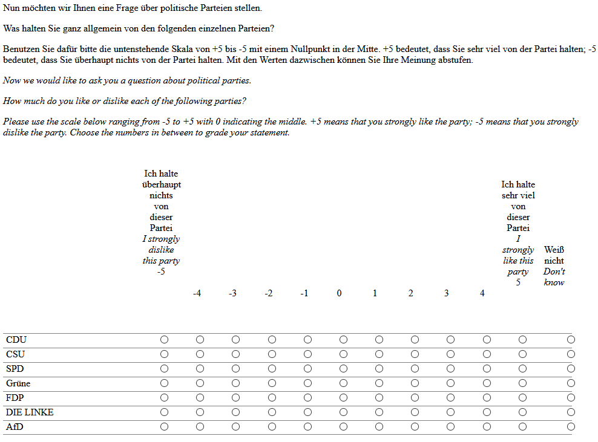
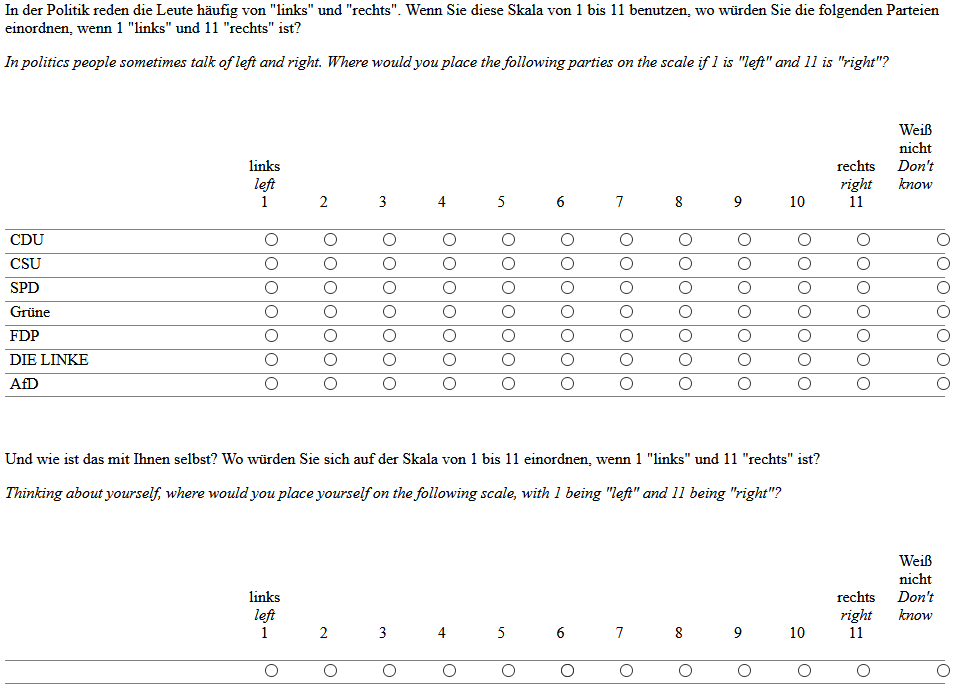

```{r setup, include=FALSE}
knitr::opts_chunk$set(echo = TRUE)

source("https://raw.githubusercontent.com/SuShikano/StatTeaching/main/func/naive_var.R")


```

## Substantive motivation

You are interested in what factor determines citizens' evaluation of political parties. More specifically, you are interested in citizens' like/dislike of parties. You are speculating ideological proximity/distance behind this kind of evaluation. That is, a citizen likes a party whose ideological position is closer to their positions than another party with a more distant position. 

To test your idea, you conducted online surveys with students visiting a lecture. To obtain the most important variables, that is, respondents' like/dislike and proximity to different parties, you asked the following questions:


```{r , echo=FALSE}




```


We can load the dataset and check its content:


```{r }
# Loading the data file
load("data/Lec_Statistics_Ideology_Data.RData")

# Check which object is loaded
ls()

# Check the inside of the data
head(long.data,n=10)


```

The data contains four variables.

- id: Identification number of responses
- wave: survey wave
* party: Which party is at stake?
    + 1: CDU; 2: CSU; 3: SPD; 4: Greens; 5: FDP; 6: AfD; 7: Linke
- skalo: Respondents' like/dislike of a party (+5 like/-5 dislike)
- lr.self: Respondents' self placement on the left-right ideology scale (+5 right most/-5 left most)
- lr: Respondents' placement of the party on the left-right ideology scale (+5 right most/-5 left most)
- time: Response time for the whole skalometer question page (in seconds)

In the dataset, we have `r nrow(long.data)` observations. Note that each observation corresponds to a response. Since a respondent can give multiple responses for different parties, s/he can appear many times in this dataset. 


## Univariate discriptive statistics

We can start with the respondents' like/dislike of parties. Below its distribution:

```{r }
plot(table(long.data$skalo),type="h",main="Like/Dislike",ylab="Frequency")

```

Assume that this measurement contains random errors which follow a normal distribution $N(0,0.09)$:

```{r}
error.dist.density <- function(x){
  dnorm(x,mean=0,sd=sqrt(0.09))
}
plot(error.dist.density,xlim=c(-2,2),
     main="Normal distribution: N(0,0.09)",
     ylab="Density",
     xlab="Measurement Error")
```

For each of 2504 observations, we generate random errors and compute the true value behind the measurement:

```{r}
set.seed(1234567) # Setting a seed so that the "random" errors can be replicated.
measurement.error <- rnorm(nrow(long.data),mean=0,sd=sqrt(0.09))

long.data$skalo.true <- long.data$skalo - measurement.error

par(mfrow=c(1,2))

plot(table(measurement.error),type="h",xlab="measurement error",ylab="Frequency")
plot(table(long.data$skalo.true),type="h",xlab="true value",ylab="Frequency")
```

This way of plot is not informative since both variables can take all real numbers and each value appears only once. That is, the measurement errors and true values here are continuous random variables. Instead of counting all possible values, we can group the values for certain ranges and plot their densities in  histograms.

```{r}

par(mfrow=c(1,2))

hist(measurement.error,xlab="measurement error",ylab="Density",freq=FALSE,
     main="Measurement error")
hist(long.data$skalo.true,xlab="true value",ylab="Density",freq=FALSE,
     main="True values")

```

We can compute some descriptive statistics of the true value. More specifically, we can obtain mean, variance and standard deviation.

```{r}
print("The number of valid observations")
print(valid.n.skalo <- length(long.data$skalo.true))

print("The mean response")
print(mean.skalo <- sum(long.data$skalo.true)/valid.n.skalo)

print("Variance of the responses")
print(var.skalo <- sum((long.data$skalo.true - mean.skalo)^2)/valid.n.skalo )

print("Standard deviation of the responses")
print(sd.skalo <- sqrt(var.skalo))

```

The above procedure is a bit tedious since you are programming hand-rolled. Fortunately, there are ready-made built-in functions in R:

```{r}
length(long.data$skalo.true)
mean(long.data$skalo.true)
var(long.data$skalo.true)
sd(long.data$skalo.true)
```

If you compare the results with those above, however, there are slight differences in variance and standard deviation. This is because `var` and `sd` functions compute the unbiased estimates. That is, you divide not by the number of observations (`r valid.n.skalo`), but $n-1$ (`r valid.n.skalo-1`) to obtain the variance.

To obtain just a variance (not an estimate), you should correct as follows:

```{r}
var(long.data$skalo.true)*(valid.n.skalo-1)/valid.n.skalo

```

In R, one can also define your own function for the naive variance:


```{r}
naive.var <- function(x){
  diff.to.mean <- x - mean(x)
  squared.diff <- diff.to.mean^2
  output <- mean(squared.diff)
  output
}

naive.var(long.data$skalo.true)
```

Below, we can also observe further variables.


```{r }
hist(long.data$lr.self,br=seq(-5.5,5.5,by=1),main="",
     xlab="Left-Right Self-Placement",
     freq=FALSE)

mean(long.data$lr.self)
naive.var(long.data$lr.self)
```


```{r }
hist(long.data$lr,br=seq(-5.5,5.5,by=1),
     xlab="Left-Right Placement of parties",main="",
     freq=FALSE)

mean(long.data$lr)
naive.var(long.data$lr)

```
## Bivariate relationship between the party placement and self-placement

Now we can inspect the joint distribution of the the left-right party-placement and self-placement. We can just plot the distribution:


```{r}
plot(long.data$lr ~ long.data$lr.self,
     xlab="Self-placement",ylab="Party placement")
```

This is however not so informative since both variables are discrete and many responses have the same value combination. Therefore, we cannot see here how many responses are behind different value combinations. Here, we can just add small random values to both measures and plot them again:  

```{r}
plot(jitter(long.data$lr) ~ jitter(long.data$lr.self),
     xlab="Self-placement",ylab="Party placement")
```

The relationship of both variables is not clear to see. We can now calculate two summary statistics: covariance and correlation:

```{r}
cov(long.data$lr , long.data$lr.self)
cor(long.data$lr , long.data$lr.self)
```

Here again, we have to be careful that `cov` gives the unbiased estimate. For simple covariance, you need to write your own function:

```{r}

naive.cov <- function(x,y){
  mean((x - mean(x))*(y - mean(y)))
}

naive.cov(long.data$lr , long.data$lr.self)

```


## Creating a new variable

We can now create new variables based on the existing variables:

* Difference between the party placement and self-placement
* Absolute value of the above difference
* Squared value of the above difference

```{r }

long.data$lr.dist.dif <- long.data$lr - long.data$lr.self
long.data$lr.dist.abs <- abs(long.data$lr.dist.dif)
long.data$lr.dist.sqr <- long.data$lr.dist.dif^2

```


```{r}
mean(long.data$lr.dist.dif)
naive.var(long.data$lr.dist.dif)
```
These values can be also obtained from the statistics of the variables, based on which the variable was created:


```{r}
mean(long.data$lr) - mean(long.data$lr.self)
naive.var(long.data$lr) + naive.var(long.data$lr.self) - 2*naive.cov(long.data$lr,long.data$lr.self)

```


## Bivariate relationship between interested variables

Now we can inspect the joint distribution of the like/dislike variable and the absolute distances. We can just again plot the distribution with small random numbers:


```{r }
plot(long.data$skalo.true ~ long.data$lr.dist.abs,
     xlab="Ideological Distance (abs)",
     ylab="Like/Dislike (true value)")

naive.cov(long.data$skalo.true, long.data$lr.dist.abs)

cor(long.data$skalo.true, long.data$lr.dist.abs)
```

Now, the same exercise for the squared distances:

```{r }
plot(long.data$skalo.true ~ long.data$lr.dist.sqr,
     xlab="Ideological Distance (sqr)",
     ylab="Like/Dislike (true value)")

naive.cov(long.data$skalo, long.data$lr.dist.sqr)

cor(long.data$skalo, long.data$lr.dist.sqr)
```


## Central limit theorem

In this section, we learn the central limit theorem by using the generated true response to party evaluation. We treat this variable as population, from which we draw multiple samples. Our goal here is to estimate the population mean.


First, we can check the population distribution: 

```{r, echo = TRUE}

pop <- long.data$skalo.true
pop.mean <- mean(pop)
pop.var <- mean((pop-pop.mean)^2)

hist(pop,freq=F)
```

The distribution is multi-modal and skewed. The population mean is `r round(pop.mean,3)` and the population variance is `r round(pop.var,3)``


From this population, we can draw multiple samples with size of 2, calculate the sample sum and observe its distribution.

```{r, echo = TRUE}
n.iter <- 5000
sample.size <- 2
all.sample.sum <- rep(NA,n.iter)
for (i in 1:n.iter){
  this.sample <- sample(pop,size=sample.size,replace=TRUE)
  this.sample.sum <- sum(this.sample)
  all.sample.sum[i] <- this.sample.sum
}

plot(density(all.sample.sum),
     main=paste0("Sum of the random draws (n=",sample.size,")"))
mean(all.sample.sum)
var(all.sample.sum)

```

From this population, we can draw multiple samples with size of 10, calculate the sample sum and observe its distribution.

```{r, echo = TRUE}
sample.size <- 10
all.sample.sum <- rep(NA,n.iter)
for (i in 1:n.iter){
  this.sample <- sample(pop,size=sample.size,replace=TRUE)
  this.sample.sum <- sum(this.sample)
  all.sample.sum[i] <- this.sample.sum
}

plot(density(all.sample.sum),
     main=paste0("Sum of the random draws (n=",sample.size,")"))
mean(all.sample.sum)
var(all.sample.sum)

```

From this population, we can draw multiple samples with size of 30, calculate the sample sum and observe its distribution.

```{r, echo = TRUE}
sample.size <- 30
all.sample.sum <- rep(NA,n.iter)
for (i in 1:n.iter){
  this.sample <- sample(pop,size=sample.size,replace=TRUE)
  this.sample.sum <- sum(this.sample)
  all.sample.sum[i] <- this.sample.sum
}

plot(density(all.sample.sum),
     main=paste0("Sum of the random draws (n=",sample.size,")"))
mean(all.sample.sum)
var(all.sample.sum)
```

From the population, we can draw multiple samples with size of 100, calculate the sample sum and observe its distribution.

```{r, echo = TRUE}
sample.size <- 100
all.sample.sum <- rep(NA,n.iter)
for (i in 1:n.iter){
  this.sample <- sample(pop,size=sample.size,replace = TRUE)
  this.sample.sum <- sum(this.sample)
  all.sample.sum[i] <- this.sample.sum
}

plot(density(all.sample.sum),
     main=paste0("Sum of the random draws (n=",sample.size,")"))
mean(all.sample.sum)
var(all.sample.sum)
```


From the population, we can draw multiple samples with size of 500, calculate the sample sum and observe its distribution.

```{r, echo = TRUE}
sample.size <- 500
all.sample.sum <- rep(NA,n.iter)
for (i in 1:n.iter){
  this.sample <- sample(pop,size=sample.size,replace=TRUE)
  this.sample.sum <- sum(this.sample)
  all.sample.sum[i] <- this.sample.sum
}

plot(density(all.sample.sum),
     main=paste0("Sum of the random draws (n=",sample.size,")"))
par(new=T)
this.norm <- function(x) dnorm(x,
                               mean=pop.mean*sample.size,
                               sd=sqrt(sample.size*pop.var))
curve(this.norm,add=T,col="blue",lty=2)
mean(all.sample.sum)
var(all.sample.sum)
```


Above, with increasing number of observations, the distribution of the sample sum becomes closer to a normal distribution. If we draw an infinitely large number of samples with a certain size, the distribution converges to a normal distribution whose mean is identical with the population mean times sample size and variance  with the population variance times the sample size: $$\sum x \sim N(n\mu , n\sigma^2)$$. If we divide the mean and variance of the above distribution (`r round(mean(all.sample.sum),3)` and `r round(naive.var(all.sample.sum),3)`) by n (`r sample.size`), we obtain `r round(mean(all.sample.sum)/sample.size,3)` and `r round(naive.var(all.sample.sum)/sample.size,3)`. These are very close to the population mean and variance (`r round(pop.mean,3)` and `r round(pop.var,3)`)


If you divide the sample sum by the sample size, you will obtain the sample mean. In the above figure, we always had the same sample size (n=500), therefore the sample mean also has the same form of the distribution, which also converges to a normal distribution.


```{r}
all.sample.mean <- all.sample.sum/sample.size
plot(density(all.sample.mean),
     main=paste0("Mean of the random draws (n=",sample.size,")"))
par(new=T)
this.norm <- function(x) dnorm(x,
                               mean=pop.mean,
                               sd=sqrt(pop.var/sample.size))
curve(this.norm,add=T,col="blue",lty=2)
```


The mean and variance of this distribution are `r round(mean(all.sample.mean),3)` and `r round(naive.var(all.sample.mean),3)`. This should follow the following: $$\bar{x} \sim N(\mu , \sigma^2 / n)$$.

